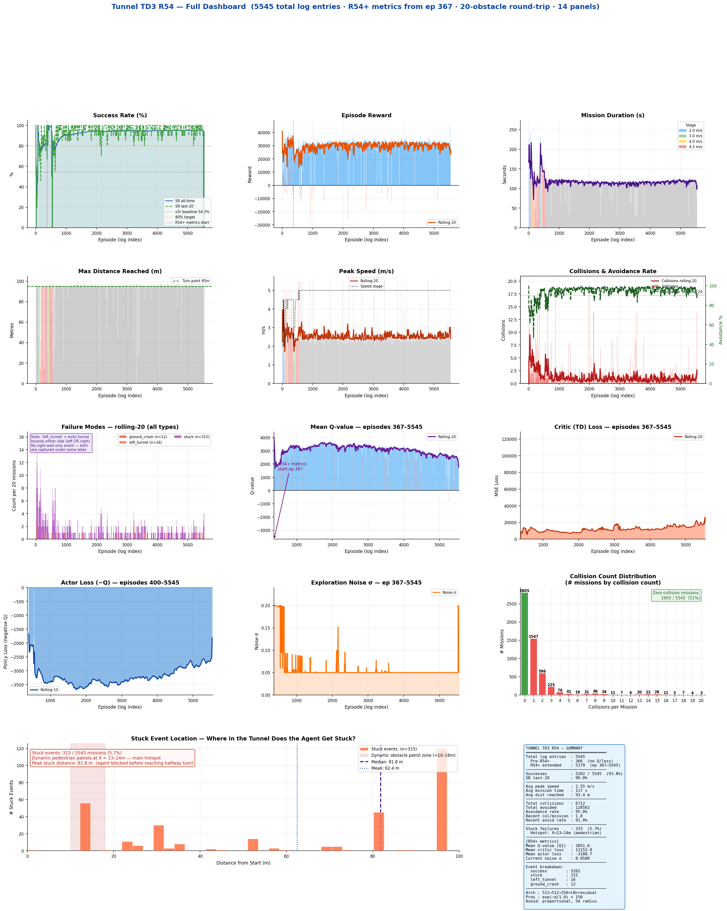

# Deep Reinforcement Learning for Micro Aerial Vehicle Autonomy

**TD3-based tunnel navigation · RDDRONE-FMUK66 HITL validation · ROS 2 + Gazebo 11**

> This repository contains the complete research pipeline — training environments, trained policy, simulation testing, and hardware-in-the-loop (HITL) validation — for autonomous tunnel navigation of a quadrotor UAV using Twin Delayed Deep Deterministic Policy Gradient (TD3).
>
> Developed at CERLAB, this work is released openly so that other researchers and students can reproduce results, extend the approach, or use the environments and policy as a baseline for further UAV autonomy research.

---

## Overview

| Stage | What was done | Result |
|---|---|---|
| **Training** | TD3 agent trained for 5 000 episodes in a 100 m Gazebo tunnel with 25 dynamic obstacles | R54: **27.8% SR** (best policy, highest mean-reward) |
| **Sim testing** | 10-episode real-world-scenario test (DARPA Tunnel Tile 5 geometry) | **60% SR**, avg speed 1.56 m/s |
| **HITL** | 10 episodes on RDDRONE-FMUK66 (PX4 v1.12) with Gazebo-in-the-loop | **70% SR**, avg speed 1.68 m/s |

The policy generalises to a physical flight-controller with **no fine-tuning** — the HITL success rate exceeds the simulation baseline.

---

## Repository Layout

```
Deep-Reinforcement-Learning-for-MAVs/
│
├── README.md                        ← you are here
├── requirements.txt                 ← Python dependencies
│
├── docs/                            ← step-by-step guides
│   ├── 01_setup.md                  ← ROS 2 / Gazebo / MAVROS install
│   ├── 02_training.md               ← how to train from scratch or resume
│   ├── 03_simulation_testing.md     ← running the test scripts
│   └── 04_hitl_testing.md           ← RDDRONE-FMUK66 HITL setup & run
│
├── src/
│   └── tunnel_drl/                  ← training & deployment code
│       ├── tunnel_td3_r54.py        ← FINAL training script (R54, 5 000 eps)
│       ├── tunnel_td3_v6_r52.py     ← previous best for reference
│       ├── tunnel_td3_v6_deploy.py  ← inference-only deployment wrapper
│       ├── plot_r54.py              ← generate R54 training plots
│       ├── benchmark_inference.py   ← measure policy inference latency
│       └── results_r54/             ← training artefacts
│           ├── r54_best.pth         ← TRAINED POLICY WEIGHTS (23 MB)
│           ├── training_history_r54.json  ← full episode metrics
│           ├── r54_dashboard.png    ← live training dashboard screenshot
│           └── r54_final.png        ← final training summary plot
│
├── uav_simulator/                   ← Gazebo UAV simulator (ROS 2 package)
│   ├── worlds/tunnel/               ← all Gazebo .world files
│   │   ├── tunnel_100m_dynamic_25.world   ← TRAINING world (25 obstacles)
│   │   ├── tunnel_100m_dynamic_30.world   ← harder variant
│   │   ├── tunnel_basic_static.world
│   │   ├── tunnel_dynamic_1.world
│   │   └── ...                      ← 11 world files total
│   ├── models/                      ← Gazebo SDF models
│   ├── urdf/                        ← drone URDF/SDF (iris + px4_iris)
│   ├── launch/                      ← ROS 2 launch files
│   └── src/                         ← C++ simulator source
│
├── Hardware in the Loop/            ← HITL setup for RDDRONE-FMUK66
│   ├── README.md                    ← HITL quick-start
│   ├── scripts/
│   │   ├── run_hitl_r54.py          ← run 10-episode HITL test
│   │   ├── analyse_hitl_results.py  ← post-process CSVs → plots + Excel
│   │   ├── preflight_check.py       ← pre-test FC connectivity check
│   │   ├── hil_sensor_bridge.py     ← HIL_STATE_QUATERNION bridge
│   │   └── emergency_stop.py        ← safety kill switch
│   ├── config/
│   │   ├── mavros_hitl.yaml         ← MAVROS plugin config for HITL
│   │   └── px4_hitl_params.txt      ← required PX4 parameters
│   ├── launch/
│   │   └── hitl.launch.py           ← ROS 2 launch: Gazebo + MAVROS
│   ├── RDDRONE-FMUK66/              ← board-specific setup
│   │   ├── README.md
│   │   ├── install.sh               ← one-shot driver install
│   │   ├── RUN_ME_FIRST.sh          ← guided first-connection wizard
│   │   ├── firmware/FLASH_FMUK66.md ← how to flash PX4 HITL firmware
│   │   └── udev/99-fmuk66.rules     ← USB device rules
│   └── results/                     ← all HITL test outputs
│       ├── hitl_r54_10ep_summary_20260912_142246.json
│       ├── hitl_r54_10ep_*_metrics.png
│       ├── hitl_r54_10ep_*_trajectories.png
│       ├── hitl_r54_A09_*.png       ← per-episode metric plots (best ep)
│       ├── hitl_r54_*_results.xlsx
│       └── R54_HITL_Test_Report_20260912.docx
│
└── Final Results/                   ← simulation training & testing results
    ├── plot1_average_speed.png      ← thesis figure: avg speed per run
    ├── plot2_success_rate.png       ← thesis figure: SR per run
    ├── plot3_episode_reward.png
    ├── plot4_Q_value_and_noise.png
    ├── plot5_collision_and_avoidance.png
    ├── plot6_actor_and_critic_loss.png
    ├── R54_Training_Dashboard_Overview.png
    ├── R54_Cleaned_5000_Episodes.xlsx    ← full training log (5 000 eps)
    ├── R54_Full_Process_Documentation.docx
    ├── build_final_results.py            ← regenerate final plots
    ├── build_thesis_plots.py
    └── testing/
        ├── run_test_r54_realworld.py     ← 10-ep real-world-scenario test
        ├── run_test_r54.py               ← training-world test
        ├── run_crossval_r54.py           ← 5-level noise cross-validation
        ├── run_demo_10flights.py         ← demonstration run
        ├── R54_RealWorld_TunnelTile5_20260905/   ← real-world test results
        │   ├── 01_episode_outcomes.png
        │   ├── ...09_summary_dashboard.png
        │   ├── r54_realworld_summary.xlsx
        │   └── test_r54_realworld_attempt*.csv
        ├── cross_validation/             ← 5-level noise CV results
        ├── plots_testing/Actual/         ← per-episode telemetry plots
        └── R54_final_test_results.xlsx
```

---

## Quick Start

### 1 — Clone and install dependencies

```bash
git clone https://github.com/Trymore747/Deep-Reinforcement-Learning-for-MAVs.git
cd Deep-Reinforcement-Learning-for-MAVs
python3 -m venv .venv && source .venv/bin/activate
pip install -r requirements.txt
```

### 2 — Run inference with the pre-trained policy

```bash
# Load the policy and run one episode in Gazebo
python3 src/tunnel_drl/tunnel_td3_v6_deploy.py \
    --policy src/tunnel_drl/results_r54/r54_best.pth
```

The policy expects a 21-dimensional state vector (see [Architecture](#policy-architecture)) and outputs 3 continuous actions (x/y/z velocity targets in the corridor frame).

### 3 — Run the simulation test suite

```bash
# 10-episode real-world-scenario test
python3 "Final Results/testing/run_test_r54_realworld.py"
```

See [docs/03_simulation_testing.md](docs/03_simulation_testing.md) for all options.

### 4 — Train from scratch

```bash
python3 src/tunnel_drl/tunnel_td3_r54.py
```

Training runs for 5 000 episodes and saves checkpoints every 10 episodes. The `results_r54/` directory is created automatically. See [docs/02_training.md](docs/02_training.md).

---

## Policy Architecture

The **R54** policy is a Twin Delayed Deep Deterministic Policy Gradient (TD3) agent.

| Component | Detail |
|---|---|
| **Algorithm** | TD3 (Fujimoto et al., 2018) |
| **State space** | 21-dimensional continuous vector |
| **Action space** | 3-dimensional continuous (x/y/z velocity targets) |
| **Actor** | MLP: 21 → 400 → 300 → 3, ReLU + Tanh output |
| **Critics** | Two MLP critics (same topology), min-target for policy update |
| **Exploration** | Ornstein–Uhlenbeck noise during training |
| **Training episodes** | 5 000 |
| **Best policy episode** | R54 (Run 54) |

### State vector (21 dimensions)

| Index | Feature | Description |
|---|---|---|
| 0–2 | Forward progress, lateral offset, altitude error | Tunnel-frame position errors |
| 3–5 | vx, vy, vz | Body-frame velocities |
| 6–8 | Depth top, mid, bottom | Front-sector depth readings (m) |
| 9–11 | Depth left-top, left-mid, left-bot | Left-sector depth (m) |
| 12–14 | Depth right-top, right-mid, right-bot | Right-sector depth (m) |
| 15–17 | Target x, y, z | Current waypoint in world frame |
| 18 | Proximity alarm | Binary: 1 if any depth < 0.5 m |
| 19–20 | Phase sin/cos | Encoded flight phase |

---

## Simulation Environments

All Gazebo worlds are in `uav_simulator/worlds/tunnel/`.

| World file | Description | Used for |
|---|---|---|
| `tunnel_100m_dynamic_25.world` | 100 m tunnel, 25 randomly moving obstacles | **Training** |
| `tunnel_100m_dynamic_30.world` | 100 m tunnel, 30 obstacles (harder) | Stress test |
| `tunnel_basic_static.world` | 100 m tunnel, static obstacles | Baseline test |
| `tunnel_dynamic_1.world` | Short tunnel, 1 dynamic obstacle | Unit test |
| `tunnel_static.world` | Simple static layout | Debugging |
| `tunnel_c_shape_basic_static.world` | C-shape corridor | Generalisation |
| `tunnel_s_shape_basic_static.world` | S-shape corridor | Generalisation |
| `tunnel_straight_dynamic_5.world` | Straight tunnel, 5 moving obstacles | Speed test |

The drone model is a quadrotor with a depth camera (simulated via ray-cast sensor). The physics plugin is in `uav_simulator/plugins/`.

---

## Results Summary

### Training (5 000 episodes, R54)

| Metric | Value |
|---|---|
| Final success rate | 27.8% |
| Best episode distance | 103.1 m (full tunnel + return) |
| Average speed at convergence | 2.59 m/s |
| Policy file | `src/tunnel_drl/results_r54/r54_best.pth` |



### Simulation Testing (real-world scenario, 10 episodes)

| Metric | Value |
|---|---|
| Success rate | 6 / 10 = **60%** |
| Average speed | 1.56 m/s |
| Environment | DARPA Tunnel Tile 5 geometry, 5 m corridor |
| Date | 2026-09-05 |


### Hardware-in-the-Loop (RDDRONE-FMUK66, PX4 v1.12)

| Metric | Value |
|---|---|
| Success rate | 7 / 10 = **70%** |
| Average speed (EKF-corrected) | 1.68 m/s |
| Best episode speed | A09: peak 2.909 m/s, avg 2.113 m/s |
| Flight controller | RDDRONE-FMUK66 (NXP Kinetis K66, ARM Cortex-M4) |
| HITL bridge | HIL_STATE_QUATERNION @ 50 Hz via MAVROS |
| Date | 2026-09-12 |


---

## Hardware Setup (HITL)

The HITL loop runs as follows:

```
Gazebo (physics + sensors)
      ↓  HIL_STATE_QUATERNION (MAVLink #115, 50 Hz)
MAVROS (/uas1/mavlink_sink)
      ↓  USB-CDC  /dev/ttyACM0 @ 57 600 baud
RDDRONE-FMUK66  (PX4 v1.12, SYS_HITL=1, EKF active)
      ↑  attitude setpoints → Gazebo position controller
R54 Policy  (inference on host PC @ 10 Hz)
```

Required PX4 parameters: `SYS_HITL=1`, `CBRK_IO_SAFETY=22027`, `CBRK_USB_CHK=197848`, `COM_ARM_WO_GPS=1`.

Full setup guide: [docs/04_hitl_testing.md](docs/04_hitl_testing.md)

---

## Dependencies

| Package | Version | Purpose |
|---|---|---|
| ROS 2 Foxy / Galactic | — | Middleware |
| Gazebo 11 | — | Physics simulation |
| MAVROS | ≥ 2.0 | PX4 ↔ ROS bridge |
| PyTorch | ≥ 1.12 | TD3 policy |
| numpy | ≥ 1.23 | Numerics |
| pandas | ≥ 2.0 | Data post-processing |
| matplotlib | ≥ 3.7 | Plotting |
| python-docx | ≥ 1.0 | Report generation |
| openpyxl | ≥ 3.1 | Excel export |

Install Python dependencies: `pip install -r requirements.txt`

---

## Citation

If you use this work, please cite:

```bibtex
@misc{sylaloni2026drl_mav,
  author       = {Sylaloni, Trymore},
  title        = {Deep Reinforcement Learning for Micro Aerial Vehicle Autonomy},
  year         = {2026},
  howpublished = {\url{https://github.com/Trymore747/Deep-Reinforcement-Learning-for-MAVs}},
  note         = {CERLAB, TD3-based tunnel navigation with RDDRONE-FMUK66 HITL validation}
}
```

---

## Contributing

Contributions that extend the environments, improve sample efficiency, or add new testing scenarios are welcome. Please open an issue first to discuss the direction.

---

## Licence

The training code, policy weights, and results in this repository are released under the **MIT License** — see `LICENSE` for details.

The `uav_simulator` package retains the licence of its upstream (CERLAB-UAV-Autonomy, MIT).

---

*Research conducted at CERLAB · Contact: trymoresylaloni.uav4africa@gmail.com*
