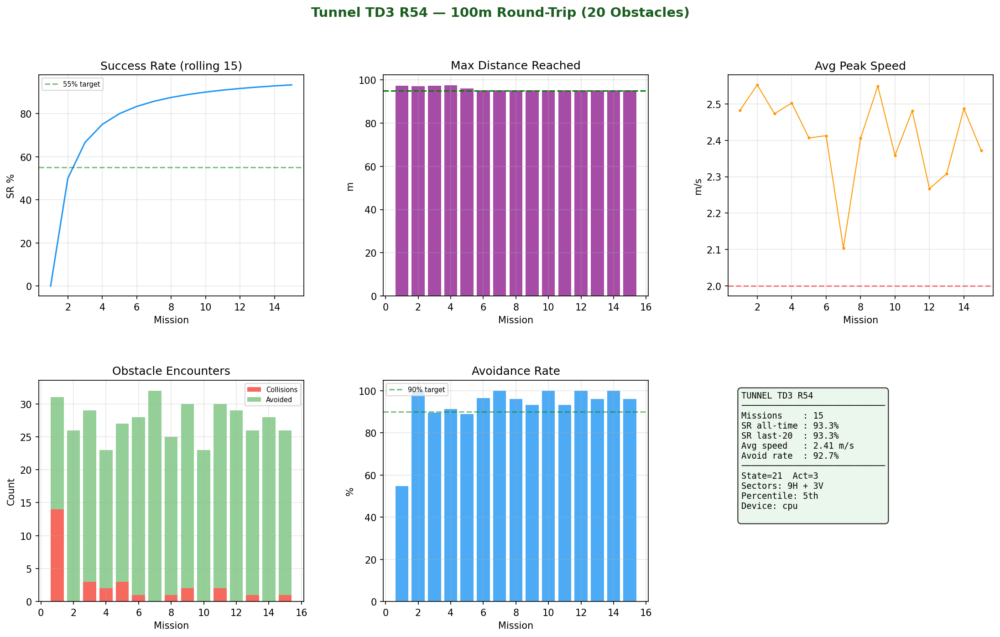

# 02 — Training the R54 TD3 Policy

## Overview

The R54 policy was trained for **5 000 episodes** in a 100 m Gazebo tunnel with **25 randomly moving obstacles**. Each episode starts with the drone at the tunnel entrance; the episode ends when the drone completes a full out-and-back traversal (SUCCESS), collides fatally, or times out (150 s).

Training took approximately **40–50 hours** on a machine with an NVIDIA GPU.

---

## Training World

```
uav_simulator/worlds/tunnel/tunnel_100m_dynamic_25.world
```

- 100 m tunnel, 5 m wide corridor (±2.5 m half-width)
- 25 spherical/box obstacles with randomised velocities per episode
- Drone starts at x = 0, target: reach x = 95 m (turn point), return to x = 0

---

## Running Training

```bash
source .venv/bin/activate

# Terminal 1 — start Gazebo with training world
ros2 launch uav_simulator start.launch world:=tunnel_100m_dynamic_25

# Terminal 2 — run training
python3 src/tunnel_drl/tunnel_td3_r54.py
```

Training creates `src/tunnel_drl/results_r54/` and saves:
- `r54_ep<N>.pth` — policy checkpoint every 10 episodes
- `r54_best.pth` — best policy seen so far (by cumulative reward)
- `training_history_r54.json` — full episode log (reward, speed, collisions, SR)

### Key Hyperparameters (in `tunnel_td3_r54.py`)

| Parameter | Value | Description |
|---|---|---|
| `GAMMA` | 0.99 | Discount factor |
| `TAU` | 0.005 | Soft target update rate |
| `ACTOR_LR` | 3e-4 | Actor learning rate |
| `CRITIC_LR` | 3e-4 | Critic learning rate |
| `BATCH_SIZE` | 256 | Replay buffer batch size |
| `BUFFER_SIZE` | 1 000 000 | Replay buffer capacity |
| `POLICY_NOISE` | 0.2 | Target policy smoothing noise |
| `NOISE_CLIP` | 0.5 | Noise clip bound |
| `POLICY_FREQ` | 2 | Actor update frequency |
| `EXPLORATION_NOISE` | 0.1 | OUNoise σ |
| `MAX_EP_SECS` | 150.0 | Episode timeout (seconds) |
| `TURN_POINT` | 95.0 | X at which drone turns around (m) |
| `CORRIDOR_HW` | 2.5 | Corridor half-width (m) |

---

## Resuming Training

To resume from a checkpoint:

```bash
python3 src/tunnel_drl/tunnel_td3_r54.py --resume src/tunnel_drl/results_r54/r54_ep2500.pth
```

---

## Monitoring Live Progress

```bash
# In a third terminal
python3 src/tunnel_drl/plot_r54.py --watch
```

This polls `training_history_r54.json` and renders a live dashboard every 30 s.

---

## Training Results (R54)

| Metric | Value |
|---|---|
| Total episodes | 5 000 |
| Final success rate | 27.8% |
| Best episode distance | 103.1 m |
| Average speed at convergence | 2.59 m/s |
| Best policy checkpoint | `r54_best.pth` |



---

## Architecture Notes

The R54 training script (`tunnel_td3_r54.py`) is self-contained. It:
- Subscribes to depth camera and odometry topics via ROS 2
- Publishes velocity setpoints to the Gazebo quadcopter plugin
- Manages the episode lifecycle (arm, takeoff, navigate, land, reset)
- Logs per-step telemetry to `training_history_r54.json`

The previous best-policy runs (R50–R53) are in `src/tunnel_drl/tunnel_td3_v6_r*.py` for reference. R54 adds improved reward shaping and adaptive exploration noise scaling.

---

## Using a Pre-trained Policy

If you just want to use the trained policy without retraining:

```python
import torch
from src.tunnel_drl.tunnel_td3_r54 import Actor

STATE_DIM  = 21
ACTION_DIM = 3

actor = Actor(STATE_DIM, ACTION_DIM)
actor.load_state_dict(torch.load("src/tunnel_drl/results_r54/r54_best.pth"))
actor.eval()

# state: torch.Tensor of shape (1, 21)
action = actor(state)   # shape (1, 3) — velocity targets
```
